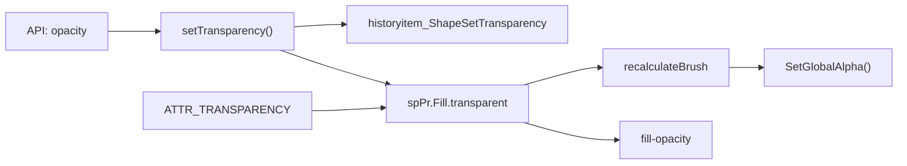
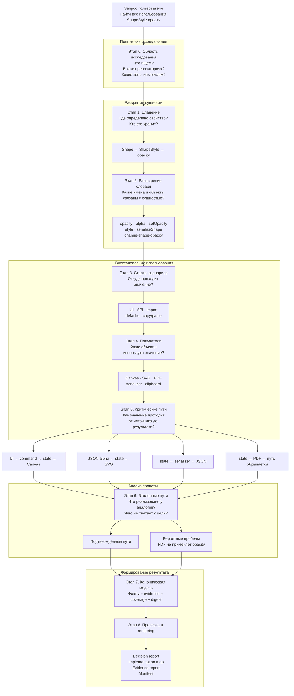
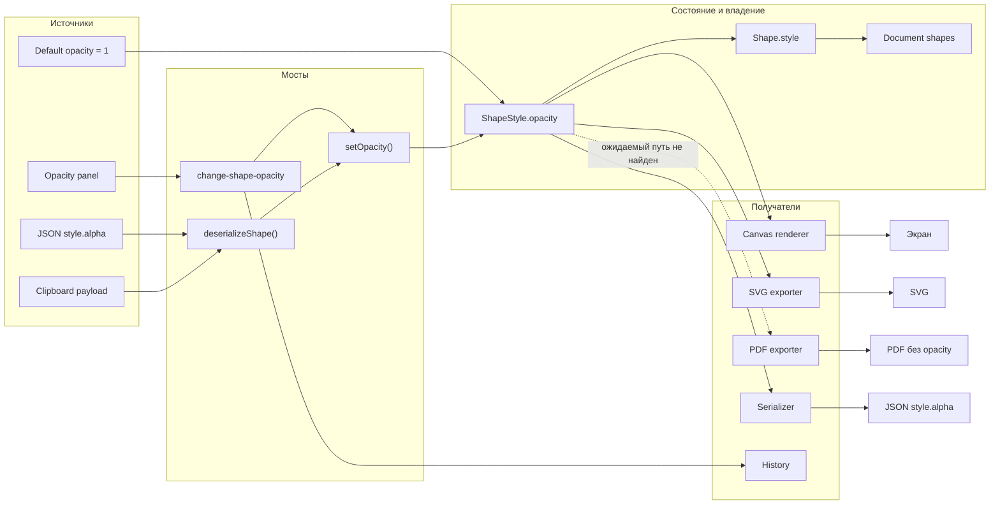

# Feature Usage Inventory AST

## Что делает скил

`feature-usage-inventory-ast` исследует полный жизненный цикл программной сущности в кодовой базе.

Целевой сущностью может быть поле модели, настройка, публичный API, команда, формат данных, визуальное свойство, пользовательский сценарий или механизм сохранения и экспорта.

Обычный текстовый поиск отвечает на вопрос:

> В каких файлах встречается имя сущности?

Скил отвечает на более широкий вопрос:

> Где сущность появляется, кто ею владеет, как она меняется, через какие объекты и слои проходит, кто её использует и в какой наблюдаемый результат она превращается?

Результат исследования — не список текстовых совпадений, а подтверждённая карта жизненного цикла сущности.

## Быстрый вход для разработчика

Используйте скил, если нужно:

- оценить полную зону влияния изменения;
- найти прямые и косвенные использования поля, модели или механизма;
- восстановить путь от UI/API/import до состояния, отображения и сохранения;
- проверить всех получателей shared-модели;
- сравнить текущую реализацию с аналогом или готовой веткой;
- найти вероятные пробелы до начала правки;
- проверить, что готовая реализация не пропустила history, copy/paste, export или другой lifecycle-путь.

Не запускайте полную инвентаризацию, если нужен только один локальный ответ: например, callers конкретного метода или устройство AST в двух известных файлах. Для этого достаточно узкого Graph/AST-запроса.

### Как выбрать тип исследования

| Ситуация | Режим | Что получится |
|---|---|---|
| Нужно найти callers одного символа | Узкий Graph/AST-запрос | Кандидаты, подтверждённые места и ограничения |
| Нужно понять один известный путь | Узкий Graph/AST-запрос | Подтверждённая цепочка или точное место разрыва |
| Нужно найти все использования | Полная инвентаризация | Карта владения, сценариев, получателей и путей |
| Планируется изменение shared-модели | Полная инвентаризация | Blast radius и существующие точки входа |
| Проверяется полнота ветки | Полная инвентаризация | Эталонные пути, расхождения и evidence |

### Предстартовый вопрос: режим и продолжение

Перед новой полной инвентаризацией навык задаёт один объединённый вопрос:

```text
Как выполнять исследование и продолжать работу между ходами?

Режим:
- strict — один канонический этап за ход;
- adaptive — несколько последовательных этапов;
- continuous — максимально непрерывное выполнение.

Продолжение:
- interactive — после остановки ждать команды `продолжай`;
- goal — автоматически продолжать через активную цель Codex.
```

Нельзя автоматически выбирать mode или driver. До получения обоих значений запрещено запускать этап 0, создавать `inventory-state.json`, сохранять task artifacts или выполнять диагностику исследования.

Если mode и driver уже явно указаны в objective активной цели, они считаются ответом пользователя и вопрос повторно не задаётся. Для существующей инвентаризации используются значения из `inventory-state.json`. Узкий Graph/AST-запрос не требует выбора mode или driver.

### Матрица mode × driver

| Mode | `interactive` | `goal` |
|---|---|---|
| `strict` | Один этап, затем ждать `продолжай` | Один этап за автоматическое продолжение |
| `adaptive` | Несколько этапов; после остановки ждать пользователя | Несколько этапов; затем новый автоматический ход |
| `continuous` | Максимум работы в текущем ходе | Автоматически продолжать до этапа 8 или блокера |

Mode определяет число этапов за ход. Driver определяет, кто инициирует следующий ход. Driver не меняет цели этапов, evidence rules, gates, permissions или каноническую последовательность.

### Остальные обязательные параметры

До начала исследования также должны быть разрешены:

- target;
- репозитории, ветки или worktree;
- каталог и формат артефактов;
- исключения и ограничения;
- для `goal` — проверяемое условие завершения.

Рекомендуемое условие завершения goal: успешно закрыт этап 8, manifest связан с trusted digest этапа 7, итоговые документы прошли валидацию и обязательных open checks не осталось.

## Учебный пример исходного кода

Рассмотрим небольшое приложение для рисования фигур. У фигуры есть свойство `opacity`, которое определяет её прозрачность.

### Модель свойства

```javascript
// shape-style.js

export class ShapeStyle {
    constructor() {
        this.opacity = 1;
    }

    setOpacity(value) {
        this.opacity = Math.max(0, Math.min(1, value));
    }
}
```

На первый взгляд может показаться, что все использования можно найти поиском `opacity`. Но в реальной кодовой базе значение проходит через несколько объектов и механизмов.

### Владелец свойства

```javascript
// shape.js

import { ShapeStyle } from "./shape-style.js";

export class Shape {
    constructor() {
        this.style = new ShapeStyle();
    }

    applyStyle(style) {
        this.style = style;
    }
}
```

`Shape` не содержит `opacity` напрямую. Он владеет объектом `ShapeStyle`, который содержит это поле:

```text
Shape → style → ShapeStyle → opacity
```

### Пользовательский сценарий

```javascript
// opacity-panel.js

export function onOpacityChanged(editor, value) {
    editor.executeCommand({
        type: "change-shape-opacity",
        value
    });
}
```

UI не изменяет модель напрямую. Он создаёт команду, в которой новое значение называется просто `value`. Поэтому поиск только по `opacity` не показывает весь путь.

### Команда и изменение модели

```javascript
// shape-commands.js

export function executeShapeCommand(editor, command) {
    if (command.type === "change-shape-opacity") {
        const shape = editor.getSelectedShape();
        shape.style.setOpacity(command.value);
        editor.history.add(command);
        editor.invalidateCanvas();
    }
}
```

Здесь значение проходит из команды в модель, добавляется в историю и инициирует перерисовку.

### Получатели свойства

```javascript
// canvas-renderer.js

export function drawShape(context, shape) {
    context.globalAlpha = shape.style.opacity;
    drawGeometry(context, shape);
}
```

```javascript
// svg-exporter.js

export function exportShape(shape) {
    return `<path opacity="${shape.style.opacity}" d="${shape.path}"/>`;
}
```

Свойство имеет как минимум двух получателей:

- Canvas renderer;
- SVG exporter.

У них разные output-пути, хотя источник состояния общий.

### Сохранение и загрузка

```javascript
// shape-serializer.js

export function serializeShape(shape) {
    return {
        path: shape.path,
        style: {
            alpha: shape.style.opacity
        }
    };
}

export function deserializeShape(data) {
    const shape = new Shape();

    if (data.style?.alpha !== undefined) {
        shape.style.setOpacity(data.style.alpha);
    }

    return shape;
}
```

В формате сохранения свойство называется `alpha`, а не `opacity`. Скил должен подтвердить связь:

```text
opacity ↔ alpha
```

и добавить `alpha` в поисковый словарь.

### Косвенное использование при копировании

```javascript
// clipboard.js

export function copyShape(shape) {
    return serializeShape(shape);
}

export function pasteShape(payload) {
    return deserializeShape(payload);
}
```

В этом файле нет слов `opacity` или `alpha`. Тем не менее copy/paste является частью жизненного цикла свойства, поскольку использует общий serializer.

Это пример косвенного использования, которое нельзя надёжно найти поиском только по имени целевой сущности.

### Возможный пробел реализации

```javascript
// pdf-exporter.js

export function exportShapeToPdf(document, shape) {
    document.drawPath(shape.path);
}
```

PDF exporter работает с тем же объектом `Shape`, но не читает `shape.style.opacity`.

Само отсутствие слова `opacity` ещё не доказывает ошибку. Однако SVG exporter показывает эталонный output-путь. Скил может зафиксировать:

```text
PDF exporter не применяет opacity
Статус: вероятный пробел реализации
Эталон: SVG exporter
```

Для окончательного вывода о дефекте всё равно потребуются продуктовые требования или подтверждение ожидаемого поведения PDF-экспорта.

## Как это выглядит в легаси-коде

Учебный пример выше намеренно прост. В легаси-проекте одно логическое свойство часто представлено разными именами, объектами и идентификаторами:

```javascript
// Shape.js

AscFormat.CShape.prototype.setTransparency = function (value) {
    History.Add(new CChangesDrawingsLong(
        this,
        AscDFH.historyitem_ShapeSetTransparency,
        this.spPr.Fill.transparent,
        value
    ));

    this.spPr.Fill.transparent = value;
    this.recalcInfo.recalculateBrush = true;
};
```

```javascript
// BinaryReader.js

case ATTR_TRANSPARENCY:
    shape.spPr.Fill.transparent = stream.GetLong();
    break;
```

```javascript
// ShapeDrawer.js

drawer.SetGlobalAlpha(
    1 - shape.spPr.Fill.transparent / 100000
);
```

```javascript
// SvgWriter.js

writer.WriteAttribute(
    "fill-opacity",
    resolveAlpha(shape.spPr.Fill.transparent)
);
```

Для пользователя это может быть одна фича — `opacity`. В исходниках она представлена как минимум шестью понятиями:

```text
Public/API name:
opacity

Mutation method:
setTransparency()

Internal storage:
spPr.Fill.transparent

History:
historyitem_ShapeSetTransparency

Binary format:
ATTR_TRANSPARENCY

Export name:
fill-opacity
```

Обычный поиск `opacity` не восстановит этот путь. Скил начинает с известных имён, раскрывает владельцев и отношения, добавляет подтверждённые aliases в словарь и проверяет каждый lifecycle-механизм отдельно.



### Что особенно важно в легаси

- Владение может быть скрыто во вложенных полях, массивах, map и общих контейнерах.
- Методы могут объявляться через `Ctor.prototype.method = function () {}`.
- Связи могут задаваться строковыми командами, событиями и числовыми schema ID.
- Одинаковая логика может быть продублирована в нескольких редакторах или экспортёрах.
- Общий base-объект может скрывать фактические семейства получателей.
- Generated-код обычно является шумом, но иногда остаётся единственным доступным consumer или контрактом формата.
- Наличие serializer не доказывает наличие renderer, history, copy/paste или обратного readback-пути.

## Пример запроса на исследование

Пользователь может сформулировать задачу так:

> Проведи полную инвентаризацию свойства `ShapeStyle.opacity`.
>
> Найди модель и всех владельцев, пользовательские и API-сценарии изменения, сериализацию и persisted-алиасы, всех получателей, rendering, export, copy/paste, history и вероятные пробелы реализации.
>
> Исследуй репозитории `core`, `web-app` и `export`. Generated-файлы и внешние зависимости не учитывай как исходный код. Mode: `strict`. Driver: `interactive`. После каждого этапа ожидай команду `продолжай`.

Краткий вариант:

> Найди все прямые и косвенные использования `ShapeStyle.opacity`, восстанови критические пути и сравни получателей с ближайшими эталонами.

Такой запрос требует полной инвентаризации, потому что содержит требование полноты, несколько архитектурных слоёв, семейства получателей, lifecycle-механизмы и поиск отсутствующих ожидаемых путей.

## Как выглядит работа в диалоге

Каждый этап остаётся отдельной канонической транзакцией, даже если несколько этапов выполняются за один ответ.

### Пример `strict + interactive`

```text
Пользователь:
Проведи полную инвентаризацию ShapeStyle.opacity.

Скил:
Выполняет этап 0.
Фиксирует scope, seeds, exclusions и ожидаемые слои.
Показывает DoD, ограничения и артефакт перехода.
Останавливается.

Пользователь:
Продолжай.

Скил:
Проверяет inventory-state.json.
Читает переход этапа 0.
Выполняет только этап 1 — модель, контейнеры и владение.
Сохраняет новый переходный артефакт.
Останавливается.

Пользователь:
Продолжай.

Скил:
Выполняет этап 2 и расширяет словарь.

...

Пользователь:
Продолжай.

Скил:
На этапе 8 формирует финальные документы
из закрытой модели этапа 7.
```

### Пример `continuous + goal`

```text
Пользователь:
/goal Проведи полную инвентаризацию ShapeStyle.opacity.
Mode: continuous.
Driver: goal.
Репозитории: core, web-app, export.
Артефакты: context/inventories/opacity, JSON facts + Markdown reports.
Исключить generated и vendor.
Завершить только после успешного этапа 8.

Скил:
Проверяет активную цель и рассчитывает objective digest.
Создаёт inventory-state.json с driver=goal.
Выполняет этапы подряд, сохраняя отдельный artifact и advance каждого этапа.
При завершении хода автоматически продолжает из state и transition artifacts.
При partial сохраняет checkpoint без advance.
Завершает цель только после digest-bound manifest этапа 8.
```

Перед первой записью артефактов скил получает каталог и формат из запроса или objective. Если этап не может быть доказательно закрыт, он остаётся `частично`; полные факты и точные open checks сохраняются в checkpoint.

## Схема работы исследования



Смысл механики в компактном виде:


## Схема движения значения в исходнике



## Как пример проходит через этапы

### Этап 0 — задаёт границы

Фиксируются цель, репозитории, исключения, исходные термины и ожидаемые слои:

```text
target: ShapeStyle.opacity
repositories: core, web-app, export
excluded: node_modules, generated bundles
seed terms: opacity, ShapeStyle, setOpacity
expected layers: model, UI, history, render, export, persistence
```

### Этап 1 — восстанавливает владение

Скил подтверждает:

```text
ShapeStyle defines opacity
Shape owns ShapeStyle through shape.style
serializeShape writes opacity as style.alpha
deserializeShape restores style.alpha through setOpacity()
```

### Этап 2 — расширяет язык поиска

Из подтверждённых исходников добавляются:

```text
alpha
setOpacity
applyStyle
change-shape-opacity
serializeShape
deserializeShape
style
```

Для каждого термина фиксируются его связь с целью, причина включения, scope и следующая поисковая группа.

### Этап 3 — находит старты

Обнаруживаются независимые начала сценариев:

```text
Opacity panel
JSON loader
Clipboard paste
ShapeStyle defaults
```

### Этап 4 — раскрывает получателей

Отдельно проверяются:

```text
Canvas rendering
SVG export
PDF export
Serialization
Clipboard
History
```

### Этап 5 — собирает end-to-end пути

```text
UI → command → state → Canvas output
Import → state → SVG output
State → serializer → JSON
Copy → serializer → clipboard
Paste → deserializer → state
```

Неполные цепочки явно отмечаются.

### Этап 6 — сравнивает с эталонами

SVG exporter используется как эталон применения прозрачности при экспорте:

```text
SVG:
Shape.style.opacity → SVG opacity

PDF:
Shape → drawPath
Переход opacity → PDF graphics state не найден
```

Результат получает статус `вероятный пробел реализации`, а не автоматически объявляется дефектом.

### Этап 7 — собирает доказательную модель

Каждое утверждение связывается с finding, evidence и исходным кодом:

```text
Утверждение:
SVG exporter применяет opacity

Finding:
svg-export-opacity

Evidence:
svg-exporter.js, exportShape(), строка с shape.style.opacity

Source integrity:
SHA-256 проверенного файла
```

### Этап 8 — формирует документы

Из одной проверенной модели создаются:

- краткий отчёт для принятия решения;
- техническая карта реализации;
- полный evidence-отчёт;
- manifest для проверки воспроизводимости.

На этом этапе новые выводы уже не добавляются.

## Как скил отличает факт от предположения

| Наблюдение | Статус | Почему |
|---|---|---|
| `CanvasRenderer` читает `shape.style.opacity` | `подтвержденное использование` | Проверен конкретный файл и операция применения |
| JSON использует поле `style.alpha` | `подтвержденное использование` | Подтверждены запись и чтение |
| Clipboard переносит opacity через общий serializer | `подтвержденное использование` | Подтверждена полная цепочка copy/paste |
| PDF exporter должен применять opacity | `подтверждение по эталону` | Ожидание основано на аналогичном SVG-пути |
| В PDF применение opacity не найдено | `вероятный пробел реализации` | Проверены ожидаемые имена и ограниченный scope |
| В локализациях найдено слово opacity | `шум` | Совпадение не связано с поведением |
| Других exporters нет | `не проверено` | Нельзя доказать без проверки полного набора exporters |

Скил не смешивает подтверждённое поведение, архитектурное ожидание, вероятный пробел, доказанное отсутствие, неподтверждённого кандидата и шум.

## Как выглядит полезный результат

Итоговая инвентаризация должна позволять принять решение о доработке, а не только перечислять найденные файлы.

Что показывает: пример компактной implementation map.

Зачем нужна: связывает слой, конкретную точку реализации, статус доказательства и последствие для изменения.

Как читать: строка со статусом `подтвержденное использование` описывает существующий путь; `вероятный пробел реализации` требует продуктового или архитектурного решения.

Как использовать: по таблице определяют blast radius, точки изменения и необходимые тесты.

| Слой | Объект или символ | Роль | Статус | Последствие |
|---|---|---|---|---|
| Model | `ShapeStyle.opacity` | Каноническое состояние | `подтвержденное использование` | Основная точка хранения |
| Ownership | `Shape.style` | Контейнер свойства | `подтвержденное использование` | Изменение затрагивает все семейства Shape |
| Persistence | `style.alpha` | Persisted alias | `подтвержденное использование` | Нужны write, readback и совместимость |
| UI | `change-shape-opacity` | Старт пользовательского сценария | `подтвержденное использование` | Нужны command и history проверки |
| Canvas | `context.globalAlpha` | Экранный output | `подтвержденное использование` | Нужен визуальный тест |
| SVG | `opacity` attribute | Export output | `подтвержденное использование` | Нужен export-тест |
| PDF | `drawPath()` | Ожидаемый получатель | `вероятный пробел реализации` | Требуется продуктовое решение |

Полный результат дополняет эту карту критическими путями, source anchors, checked-no-usage проверками, ограничениями покрытия и evidence-отчётом.

## Ограничения Graph/AST в легаси-проекте

GitNexus и локальный AST ускоряют навигацию, но не гарантируют полноту.

Типичные слепые зоны:

- stale или неполный индекс;
- prototype-style JavaScript, который не попал в граф;
- динамический доступ `object[fieldName]`;
- строковый command/event dispatch;
- callbacks и event bus без статического ребра;
- aliases, известные только через формат данных;
- числовые идентификаторы binary-схемы;
- runtime monkey patching;
- межрепозиторные bridges;
- generated consumers;
- платформенные или сборочные ветки.

Практические последствия:

- пустой `query`, `context`, `impact` или AST-результат не означает отсутствия использования;
- stale index разрешено использовать для навигации, но не для доказательства текущего поведения;
- кандидаты подтверждаются чтением исходного кода и точечным поиском;
- отсутствие фиксируется только с ожидаемыми именами, причиной ожидания и точным scope;
- если часть scope недоступна, результат остаётся `не проверено` или открытым ограничением;
- source-файлы являются финальным evidence, а Graph/AST — способом быстрее к нему прийти.

# Техническая организация работы

Скил является поэтапной надстройкой над `feature-usage-inventory` и сохраняет совместимость с его правилами доказательности, статусами и структурой итогового отчёта.

## Основные принципы

### Граф и AST находят кандидатов, но не доказывают использование

GitNexus и локальный AST-анализ используются как навигационный слой. Результат становится подтверждённым использованием только после проверки конкретного файла, символа, роли и связи с целевой сущностью.

Пустой результат GitNexus, отсутствие ребра в графе, неразрешённый символ, stale index или отсутствие AST-совпадения не доказывают отсутствие использования.

### Полная инвентаризация выполняется строго по этапам

Полный workflow состоит из этапов 0–8 и работает как машина состояний:

1. Число этапов за ответ определяется выбранным режимом; каждый этап остаётся отдельной канонической транзакцией.
2. После этапа сохраняется переходный артефакт.
3. В `strict` за ход выполняется один этап; `adaptive` и `continuous` выполняют несколько согласно своим правилам. После остановки `interactive` продолжается пользовательской командой, а `goal` — автоматически.
4. Следующий этап использует артефакт предыдущего этапа и не начинает исследование заново.
5. Финальные документы создаются только на этапе 8.

Текущее состояние хранится в `inventory-state.json`.

Актуальная схема состояния — `3.0.0`. Она хранит:

- `execution.mode`;
- `execution.driver`;
- `execution.runStatus`;
- число автоматических продолжений;
- последний progress digest;
- счётчик повторяющегося блокера;
- stages completed в текущем ходе;
- goal objective digest;
- canonical stage и artifact;
- trusted Stage 7 digest;
- partial resume contract;
- open checks и bounded probes.

Старые состояния мигрируют безопасно:

```text
1.0.0 → mode=strict, driver=interactive
2.0.0 → прежний mode, driver=interactive
```

Миграция никогда не включает goal автоматически.

Перед этапом выполняется:

```powershell
node scripts/stage_state.js assert --state <inventory-state.json> --stage <N>
```

После успешной валидации этапа состояние переводится вперёд командой `advance`.

Новая интерактивная инвентаризация инициализируется так:

```powershell
node scripts/stage_state.js init `
  --state <inventory-state.json> `
  --mode <strict|adaptive|continuous> `
  --driver interactive
```

Goal-driven инвентаризация требует objective digest:

```powershell
node scripts/goal_contract.js --request <goal-contract.json>

node scripts/stage_state.js init `
  --state <inventory-state.json> `
  --mode <strict|adaptive|continuous> `
  --driver goal `
  --objective-digest <sha256>
```

Ограниченная дополнительная проверка оформляется как `bounded-probe`. Она привязывается к текущему этапу, но не считается отдельным этапом и не изменяет каноническое состояние.

### Результаты не записываются без согласования

До создания отчётов, stage-артефактов, кэшей или необработанных результатов скил уточняет:

- куда сохранять результаты;
- в каком формате их сохранять;
- какой набор артефактов требуется.

Предварительный текст разрешено показывать в чате без записи в файлы.

## Диагностика окружения

Перед полной инвентаризацией, тестированием скила или работой в новом окружении выполняется:

```powershell
node scripts/diagnose.js --pretty
```

Для явной проверки набора репозиториев:

```powershell
node scripts/diagnose.js --repos sdkjs,web-apps,desktop-apps --pretty
```

Диагностика работает без сети и проверяет Node.js, локальный SWC, обязательные скрипты, базовый `feature-usage-inventory`, `rg`, Git и доступность GitNexus.

Возможные результаты:

- `ready` — необходимые средства доступны;
- `degraded` — workflow доступен, но имеет ограничения;
- `blocked` — отсутствует обязательная зависимость.

При `blocked` исследование останавливается. Ограничения `degraded` сохраняются в отчёте как открытые ограничения.

## Работа через активную цель Codex

Goal является driver повторных ходов, а не новым execution mode. Навык не создаёт и не включает цель без явного запроса пользователя.

### Goal contract и objective digest

Перед этапом 0 из objective должны быть получены:

- target;
- repositories, branches или worktrees;
- mode;
- artifact destination и format;
- exclusions и permissions;
- completion condition.

Существенные параметры нормализуются:

```powershell
node scripts/goal_contract.js --request <goal-contract.json>
```

Скрипт возвращает стабильный SHA-256 `objectiveDigest`. Комментарии прогресса и косметическое изменение текста не влияют на digest. Изменение target, scope, mode, artifact destination, exclusions или completion condition требует подтверждения пользователя.

### Автоматическое продолжение

Каждый новый goal-ход начинается так:

```powershell
node scripts/stage_state.js continue-run `
  --state <inventory-state.json> `
  --objective-digest <sha256>
```

Затем работа восстанавливается из `currentStage`, `canonicalArtifact`, `resume` и `openChecks`. История диалога не является источником состояния, а закрытые этапы не выполняются повторно.

### Partial checkpoint

Если этап не завершён, полные stage-local facts сохраняются и регистрируются без `advance`:

```powershell
node scripts/stage_state.js checkpoint `
  --state <inventory-state.json> `
  --artifact <partial.json> `
  --progress-digest <sha256> `
  --next-action <exact-action> `
  --reason <reason>
```

Checkpoint позволяет продолжить текущий этап после нового хода или сжатия контекста. Он не доказывает поддержку work-unit resume, если конкретный runner не имеет такого контракта.

### Stop и blocked

Конкретная остановка фиксируется так:

```powershell
node scripts/stage_state.js stop-run `
  --state <inventory-state.json> `
  --reason <stable-reason> `
  --progress-digest <sha256>
```

Сложность, длительность или необходимость нового автоматического хода не являются блокерами. Блокерами являются отсутствующее разрешение или решение пользователя, недоступный обязательный вход, failed gate без новых данных либо небезопасное расширение scope.

Три последовательных goal-хода с одинаковыми reason и progress digest переводят run в `blocked`. Автоматический ход не может сам снять блокировку. После нового пользовательского ввода или изменения внешнего состояния требуется:

```powershell
node scripts/stage_state.js continue-run `
  --state <inventory-state.json> `
  --objective-digest <sha256> `
  --acknowledge-blocker true
```

### Завершение goal

Этап 8 продвигается только с закрытым `manifest.json`, чей input digest совпадает с trusted digest этапа 7. После этого выполняется:

```powershell
node scripts/stage_state.js complete-run --state <inventory-state.json>
```

Цель нельзя завершить на границе этапа, из-за окончания ответа или из-за малого контекстного окна.

## Два типа исследования

### Полная инвентаризация

Используется для запросов «найди все использования», «проведи инвентаризацию», «оцени зону доработки», «сравни ветки», «проверь полноту отчёта» и «исследуй по этапам».

В этом режиме обязательны этапы 0–8, переходные артефакты, проверки покрытия и итоговая валидация.

### Узкий Graph/AST-запрос

Применяется для ограниченного вопроса: callers одного символа, один trace, impact одной функции или AST-структура заданного набора файлов.

Workflow:

1. Зафиксировать символ, репозиторий, файлы, инструменты и исключения.
2. Найти кандидатов минимально необходимым Graph/AST-запросом.
3. Подтвердить важные результаты в исходном коде.
4. Представить результат, evidence, ограничения и оставшиеся неизвестные.

Если поиск раскрывает несколько слоёв, семейства получателей или межрепозиторные сценарии, узкий workflow прекращается и инициируется полная инвентаризация с этапа 0.

# Этапы полной инвентаризации

## Этап 0. Подготовка

Цель этапа — определить точные границы исследования до широкого поиска.

Фиксируются:

- целевая сущность;
- режим исследования;
- способ продолжения `interactive|goal`;
- репозитории, ветки и worktree;
- каталоги исходного кода и тестов;
- разрешённые и запрещённые источники;
- исключения и профили шума;
- исходные поисковые термины;
- ожидаемые архитектурные слои;
- план поиска по содержимому и именам файлов.

Начальный словарь включает канонические имена, persisted-имена, API-имена, UI-команды, lifecycle-термины, legacy-алиасы и варианты регистра.

Предпочтительно используется `scripts/stage0_runner.js`. На этапе 0 выполняется только точный файловый или текстовый поиск для формирования исходных кандидатов. AST и рекурсивное раскрытие владельцев ещё не запускаются.

Результат — scope, seeds, exclusions и переходный артефакт для этапа 1.

## Этап 1. Нижние слои и владение

Цель этапа — найти модель, непосредственные контейнеры, владельцев и механизмы сериализации.

Исследуются:

- прямое определение модели или типа;
- поле непосредственного контейнера;
- ветви владельцев;
- бинарная и нативная сериализация;
- форматная и API-сериализация;
- ограничения графа и индекса.

Целевая сущность получает порядок 0. Отношения `stores`, `owns`, `contains` и `wraps` увеличивают порядок владения. Serializer, history, copy, API и render остаются вспомогательными связями.

Порядок работы:

1. Прочитать переходный артефакт этапа 0.
2. До разбора файлов составить единый request.
3. Выполнить один канонический GitNexus `context`.
4. Разобрать кандидатные файлы через `stage1_runner.js`.
5. Подтвердить кандидатов с помощью `source_evidence.js`.
6. Сохранить полные факты отдельно и передать модели компактное summary.
7. Выполнить `stage1_coverage_gate.js`.

Producer-consumer граница на этом этапе сохраняется только как кандидат для этапов 2–3.

## Этап 2. Расширение словаря

Цель — раскрыть объекты второго, третьего и последующих порядков, aliases, wrappers, bridges и reference-path candidates.

Для каждого нового термина сохраняются:

- связь с известным объектом;
- метод или свойство связи;
- причина включения;
- repository/file scope;
- evidence-статус;
- следующая поисковая группа.

Этап получает только структурированный переход этапа 1. Потеря обязательного поля или открытой проверки блокирует продолжение.

Предпочтительно используется один запрос `stage2_runner.js`:

1. Компилируется полный AST query plan.
2. GitNexus определяет кандидатные файлы и символы.
3. AST запускается только по явным кандидатным файлам.
4. Каждый файл разбирается один раз за runner session.
5. Результаты группируются семантически.
6. Выбранные кандидаты подтверждаются в исходниках.
7. Выполняется `coverage_gate.js`.
8. После изменения проекций выполняется `quality_equivalence.js`.

Сохраняются полные totals, semantic groups, digests, first anchors и признаки truncation. Ограничение вывода может уменьшить число показанных примеров, но не полные факты.

## Этап 3. Сценарии и старты

Цель — найти пользовательские и технические места начала сценария:

- UI;
- public API;
- command/controller;
- importer или loader;
- open, paste и drop;
- defaults, styles и templates;
- tests и fixtures;
- background flows.

Для bounded consumer scopes применяется `stage3_runner.js`. Отсутствующий consumer scope получает статус `не проверено`, а не «использования нет».

Для каждого найденного места исходный код должен подтвердить характер старта и переход из frontend/product-слоя в core или SDK.

## Этап 4. Получатели

Цель — найти все семейства объектов, которые получают, хранят, применяют, возвращают или выводят целевую сущность.

Для каждого семейства проверяются:

- creation/defaults;
- user/API mutation;
- import/deserialization;
- recalculation/cache;
- rendering/preview;
- export/serialization;
- copy/paste;
- tests/fixtures.

Также проверяются base-классы, interfaces, dispatch по типу объекта и расхождения общих путей.

Предпочтительно используется `stage4_runner.js`. Семейства объявляются в request. Runner сохраняет полные наблюдения и публикует check IDs для этапа 5.

## Этап 5. Критические пути

Цель — построить минимальные end-to-end цепочки от источника значения до observable output или persisted result.

Обязательные классы путей:

- Source/Import → Internal State → Output;
- User/API → Internal State → Output;
- Internal State → Persistence/Export.

При необходимости добавляются defaults, parent/container, copy/paste, history, collaboration, compatibility, fixtures, cache, preview, print и отдельные export-пути.

Путь подтверждён только при наличии evidence для старта, перехода во внутреннее состояние и output/persistence. Отдельно найденный serializer или renderer считается неполным путём.

Предпочтительно используется `stage5_runner.js`. После оптимизации запускается `stage5_equivalence_gate.js`, сравнивающий проверки, anchors, coverage counters и SHA-256 исходников.

## Этап 6. Эталон и ожидаемая реализация

Цель — сравнить целевую сущность с существующими аналогичными механизмами.

Эталоном может быть соседнее свойство, близкая модель, общий контейнер, существующий получатель, lifecycle-путь, архитектурный контракт, готовая ветка или несколько частичных аналогов.

Предпочтительно используется `stage6_runner.js`. Он фиксирует точный Git commit, name-status, patch anchors и SHA-256 заявленных source surfaces.

Для каждого возможного пробела указываются ожидаемый путь, имя, место, владелец, форма реализации, причина ожидания, проверенный scope и статус.

Подтверждение по эталону нельзя выдавать за использование целевой сущности. Отсутствующий ожидаемый путь получает статус `вероятный пробел реализации`, если требования не доказывают дефект.

## Этап 7. Каноническая модель отчёта

Цель — собрать факты этапов 0–6 в нормализованную `inventory-report-model/1.0.0`.

`stage7_runner.js`:

- нормализует статусы и связи;
- проверяет finding → evidence → source;
- сохраняет ограничения;
- проверяет coverage;
- исправляет допустимые структурные несоответствия;
- вычисляет канонический digest.

Затем выполняется:

```powershell
node scripts/stage7_coverage_gate.js --facts <report-model.json>
```

Этап остаётся на стадии 7, пока не пройдут schema, references, semantics, coverage, evidence integrity и determinism.

## Этап 8. Финальная приёмка и rendering

Этап получает только закрытую и хешированную модель этапа 7:

```powershell
node scripts/stage8_runner.js `
  --model <report-model.json> `
  --output-dir <directory> `
  --state <inventory-state.json>
```

Runner сверяет доверенный digest, повторно валидирует модель без изменений, формирует документы и создаёт manifest с hashes.

На этапе 8 запрещено проводить исследование, исправлять модель, переинтерпретировать факты или добавлять выводы.

Формируются:

- decision report;
- implementation map;
- evidence report;
- `manifest.json`.

## Статусы результатов

Скил использует статусы:

- `подтвержденное использование`;
- `подтверждение по эталону`;
- `вероятный пробел реализации`;
- `проверено, использования нет`;
- `неприменимо`;
- `не проверено`;
- `расхождение с готовой веткой`;
- `шум`.

`Проверено, использования нет` допустимо только при записи ожидаемых имён, причины ожидания, точного scope, проверенных связанных объектов и результата для рассматриваемого пути.

## Артефакты и трассируемость

Полные факты сохраняются вне контекста модели. Основная цепочка:

```text
утверждение отчёта → finding → evidence → файл/диапазон/hash
```

AST-backed bundle обычно содержит:

```text
stage-N/
├── report.md
├── manifest.json
├── transition.json
├── facts.json
├── findings.jsonl
├── evidence.jsonl.gz
├── coverage.json
├── validation.json
└── evidence-view/
```

Bundle является базой результатов и доказательств, а не computation cache. При повторном использовании проверяется актуальность Git commit и SHA-256 исходников.

## Контроль размера и качества

- Полный query plan составляется до AST-разбора.
- Каждый файл разбирается один раз за runner session.
- Сначала вычисляются все группы, counters и digests.
- Затем выбираются репрезентативные примеры.
- Truncation обозначается явно.
- Отсутствие в проекции не является отсутствием в исходниках.
- Обязательные группы и anchors нельзя удалять ради бюджета.
- При переполнении этап остаётся частичным.
- Для bounded source context применяется `source_slice.js`.

## Отчёт по каждому этапу

Каждый этап завершается:

- описанием входных артефактов;
- перечнем действий;
- новыми фактами и evidence;
- DoD;
- статусом `закрыт`, `частично` или `не закрыт`;
- переходным артефактом;
- `Stage Execution Report`;
- следующим этапом;
- продолжением согласно driver: ожиданием `продолжай` либо активной целью.

Переходный артефакт сохраняет target, scope, этап, статус, подтверждённые факты, кандидатов, словарь, граф, исключения, открытые проверки и следующий этап.

Для `interactive` Execution Status содержит:

```text
continuation: resume command: продолжай
```

Для `goal`:

```text
driver: goal
goal status: active|blocked|complete
progress digest changed: yes|no
automatic continuation: active|paused|complete
user action required: no|<exact decision>
```

## Валидация скила

```powershell
npm run validate
npm test
node scripts/diagnose.js --pretty
```
