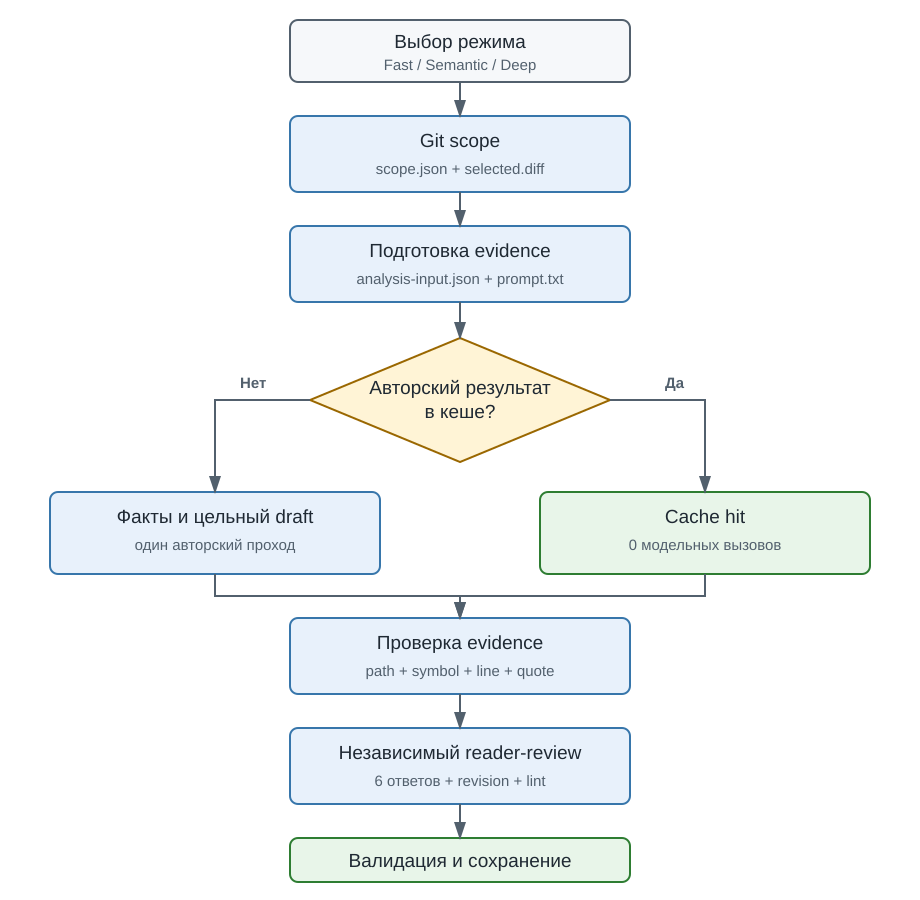

# Как работает PR Message

Навык формирует описание PR из текущего Git scope и сохраняет результат вместе с подтверждающими артефактами в контексте задачи.

Основной принцип: перед запуском пользователь выбирает один из трех режимов. Скилл не выбирает режим молча.

```text
Git scope
  -> компактный пакет evidence
  -> кеш авторского результата
  -> Fast: локальные факты
  -> Semantic: текущий Codex пишет факты и цельный draft
  -> Deep: внешний DeepSeek пишет факты и цельный draft
  -> проверка evidence
  -> независимый reader-review по шести вопросам
  -> валидация и сохранение
```



## Как использовать

Перед Git-анализом скилл задает вопрос:

```text
Какой режим использовать?
- Fast — без токенов модели, быстрый технический черновик.
- Semantic — информативное описание для ревью, авторский анализ Codex и независимый компактный reader-review.
- Deep — внешний DeepSeek через Polza.ai, медленнее и только с разрешением передачи diff.
```

Если режим уже явно указан в исходном запросе, дополнительное подтверждение не требуется.

Описание текущей ветки относительно основной ветки проекта:

```text
Используй $pr-message и подготовь описание PR для изменений текущей ветки.
```

После такого запроса скилл сначала предложит выбрать режим.

Явный быстрый режим:

```text
Используй $pr-message в режиме Fast и подготовь технический черновик описания PR.
```

Смысловой режим без внешнего провайдера:

```text
Используй $pr-message в режиме Semantic. Подготовь информативное описание для ревью.
```

С явной базовой веткой и незакоммиченными изменениями:

```text
Используй $pr-message. Подготовь описание текущей ветки относительно origin/v7.4.0, включая worktree и untracked-файлы.
```

С явным контекстом задачи:

```text
Используй $pr-message и сохрани описание с артефактами в context/RET-1459.md.
```

Повторный запуск после изменения исходников:

```text
Пересобери описание PR через $pr-message по актуальному diff. Не используй предыдущее описание как источник фактов.
```

Глубокий анализ через DeepSeek разрешается только явно:

```text
Используй $pr-message в режиме deep и DeepSeek через Polza.ai. Разрешаю передать выбранный diff для read-only анализа.
```

## Этапы

### 1. Git scope

`collect-git-scope.js` определяет base/head, committed diff и выбранный worktree. При `--include-worktree` учитываются изменённые и неигнорируемые untracked-файлы, включая бинарные.

Результат: `scope.json` и транзитный `selected.diff`.

### 2. Подготовка evidence

`prepare-analysis-input.js` проверяет хеш diff, выделяет изменённые строки, сокращает тестовый шум и извлекает кандидаты:

- символы;
- feature flags;
- события;
- callback-значения;
- пороги и правила;
- названия тестов.

Потенциальные секреты редактируются. Для модели создаётся компактный `analysis-prompt.txt`: каждая retained-строка получает ID `E1`, `E2` и т.д., а метки символов, событий, флагов и правил добавляются к этой же строке вместо отдельного дублирующего каталога. Полный репозиторий модели не передаётся.

### 3. Fast mode

`build-fast-facts.js` локально формирует evidence-backed `facts.json` из commit subjects, измененных файлов, символов, событий, feature flags, callback-значений, правил и тестов. Бизнес-мотивация не выдумывается: если ее нельзя восстановить, это остается явным ограничением fast-описания.

Если пакет обрезан, состоит из бинарных изменений или не содержит достаточного production evidence, результат помечается `deep_recommended`. Внешний анализ автоматически не запускается.

### 4. Semantic mode

Semantic использует текущую модель Codex, но передает ей только `analysis-prompt.txt` размером не более 35 КБ. При cache miss оркестратор возвращает `analysis_required`; скилл формирует один `author-output.json` с evidence-backed фактами и цельным описанием, затем возобновляет запуск с `--mode semantic --author-output`.

Репозиторий повторно не читается, пока компактный пакет не содержит явного блокирующего пробела. Точный token usage текущего Codex runner не предоставляет; оценки строятся по размерам фактических входов и выходов.

### 5. Кеш

Ключ включает:

```text
diff hash + schema version + preparer version + prompt version + route identity
```

При cache hit модель не вызывается. Невалидированные факты в кеш не попадают.

Fast, Semantic и Deep используют разные cache identity и не подменяют результаты друг друга.

### 6. Deep mode

Модель формирует `author-output.json`: проверяемые `facts` и цельный draft:

- контекст, решение и результат;
- архитектуру до и после;
- изменения, правила, контракты и потоки;
- добавленные тесты;
- неизвестные.

Каждый факт из исходников содержит точный путь, строку и цитату. Тест в diff не считается выполненной проверкой.

DeepSeek вызывается только при явном `--mode deep --allow-external`, одним запросом без shell, плагинов и доступа к репозиторию. Требуются профиль Polza.ai и `POLZA_AI_API_KEY`.

### 7. Автор и независимый reader-review

Автор Semantic/Deep возвращает только `evidence_ids`; оркестратор детерминированно восстанавливает по ним полные repository/path/line/quote перед проверкой и кешированием. Старый полный формат остается совместимым. В Fast Markdown по-прежнему строится детерминированно. В Semantic/Deep факты не дублируют `impact`: автор сразу помещает причины и последствия в цельный draft.

`editorial-lint.js` проверяет обязательные разделы, повтор контекста и заголовка, дубли между разделами и лимит причин.

В Semantic и Deep оркестратор затем возвращает `reader_review_required`. Новый читатель получает только authored draft, компактный каталог `id/kind/claim`, результат механического lint и единый `reader-contract.md`; summary, architecture, impact и source quotes повторно не передаются. Reader отвечает на шесть вопросов: проблема, условие запуска, сквозной поток, результаты/исключения, ключевые правила/значения/владение конфигурацией, проверка/риски.

Если исходный draft уже качественный, reader возвращает audit-only `decision: pass` без копии draft и повторных ответов до/после. Полный `revised_draft` создается только при реальных замечаниях (`decision: revise`).

Reader дополнительно классифицирует каждый факт типа `rule`, `contract` и `feature_flag`: покрыт коротким уникальным `anchor` из итогового текста или осознанно опущен с причиной. Числовые правила, формулы и пороги опускать нельзя.

`apply-editorial-revision.js` проверяет hash авторского draft, полноту rule coverage, точное наличие процитированных фрагментов, ясность всех шести ответов после ревизии, отсутствие нерешенных замечаний, quality dimensions и повторный механический lint. Самостоятельно выставленного `pass` больше недостаточно.

Успешный `revision.json` сохраняется рядом с описанием и повторно применяется только к тому же draft hash.

### 8. Сохранение

`finalize-run.js` выполняет одну итоговую валидацию и сохраняет:

- `pr-description.md`;
- `scope.json`;
- `facts.json`;
- `author-output.json` для Semantic/Deep;
- `editorial-review.json`;
- опциональный `model-usage.json`;
- `validation.json`;
- `manifest.json`.

`selected.diff`, `analysis-input.json` и `analysis-prompt.txt` удаляются после успешного завершения.

## Экономия токенов

Fast mode не расходует модельные токены и обычно завершается за несколько секунд. Semantic использует один авторский проход и один компактный reader-review. На контрольном RET-1459 evidence ID, объединенные candidate/evidence и единый reader contract снизили центральную оценку полного модельного обмена с 21,2 до 16,9 тыс. токенов (-20,5%) при побайтно одинаковом итоговом Markdown. Deep остается явной внешней альтернативой, но также проходит reader-review. Валидный авторский результат кешируется до reader-review, поэтому ошибка или повтор reader-стадии не запускает автора заново; финальное описание при этом сохраняется только после всех проверок.
