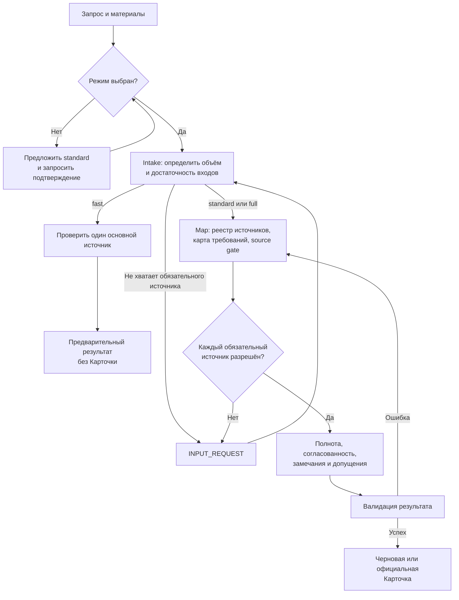

# Requirements Review

## Назначение

`requirements-review` оценивает, достаточно ли описания задачи и БФТ, чтобы начать разработку. Скилл выявляет недостатки требований, проверяет обязательные связанные материалы и готовит один из результатов:

- предварительный результат быстрой проверки;
- черновую Карточку Заключения Разработки;
- официальную Карточку, если источники закрыты, автор указан и допущения подтверждены.

Скилл не оценивает архитектуру, код, сроки, трудоёмкость, тест-план или готовность к финальной приёмке.

## Пример использования

Передайте БФТ и попросите проверить требования:

```text
Используй $requirements-review. Режим standard.
Проверь приложенную БФТ для задачи «Экспорт отчёта в PDF».
```

Если режим не указан, скилл предложит `standard` и дождётся подтверждения. Для короткой предварительной проверки можно выбрать `fast`; для всего заявленного комплекта материалов — `full`.

## Схема работы



`source gate` закрыт, когда каждый обнаруженный источник либо проверен (`REVIEWED`), либо обоснованно исключён, либо его подтверждённое отсутствие оформлено блокирующим замечанием.

Для сохраняемой проверки скрипт `scripts/review_state.py` хранит revisions источников, source gate, snapshots и историю artifacts. Он контролирует целостность состояния, но не решает за аналитика, что считать обязательным требованием или недостатком.

## Пример работы по схеме

Проверяется задача «Экспорт отчёта в PDF» в режиме `standard`.

1. Пользователь передаёт БФТ. В ней указана ссылка на обязательный макет PDF.
2. На этапе intake режим и БФТ достаточны, поэтому скилл переходит к map.
3. Map добавляет БФТ и макет в реестр. БФТ доступна, а макет по ссылке не предоставлен: `INPUT_REQUIRED`. Source gate открыт.
4. Скилл запрашивает экспорт макета или доступ к нему, не формируя Карточку.
5. Пользователь присылает `layout.pdf`. Макет становится `AVAILABLE`; после разбора БФТ и макета оба источника получают `REVIEWED`, а gate закрывается.
6. Проверка полноты обнаруживает, что формат страницы не описан. Если это безопасно компенсировать, скилл формирует конкретное допущение, например «использовать A4, книжную ориентацию».
7. Без подтверждения допущения итогом будет черновая Карточка. После явного подтверждения допущения и указания автора — официальная Карточка.

При использовании сохраняемого состояния тот же путь выглядит так:

```text
init-case → add-source → validate-map → update-source → mark-reviewed
→ validate-map → snapshot → issue-artifact
```

Если БФТ, макет, policy-файл или доказательное событие изменятся, скрипт пометит текущий artifact устаревшим. Для новой версии материалов потребуется новый run и новый результат.

## Пример отчёта

Ниже — пример официального результата для того же сценария после предоставления макета, указания автора и подтверждения допущения. Контекст расположен вне Карточки.

```text
Режим: standard.
Проверенные источники: БФТ «Экспорт отчёта в PDF», макет layout.pdf.
Исключённые источники: не выявлены.
Подтверждённо отсутствующие источники: не выявлены.

ЗАКЛЮЧЕНИЕ РАЗРАБОТКИ

Автор Заключения Разработки: Иван Иванов.

Заключение: Готово к разработке.

Замечания:

1.
Требование или его идентификатор: Формат экспортируемого PDF.
Замечание: В БФТ не указан формат страницы и ориентация документа.
Допущение: Использовать формат A4 в книжной ориентации.
Статус: Некритичное.
```

Если автор не указан или допущение ещё не подтверждено, скилл выводит тот же текст как черновик и добавляет перед Карточкой `ЧЕРНОВИК` с причиной.
