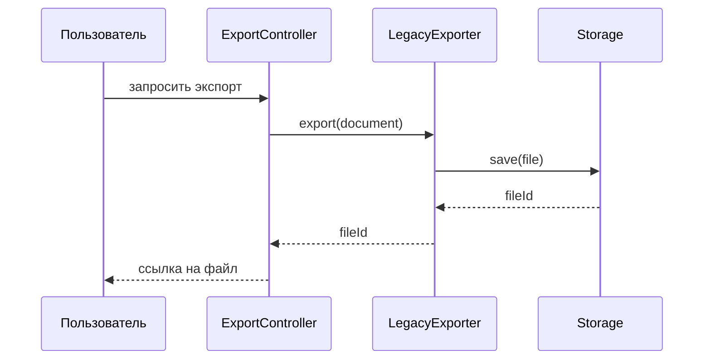
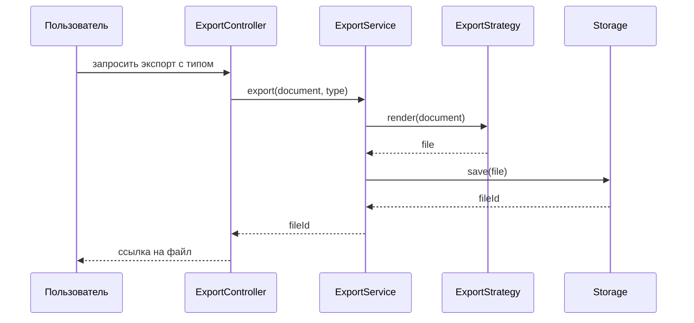
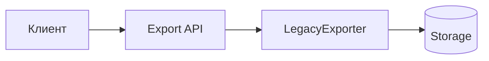
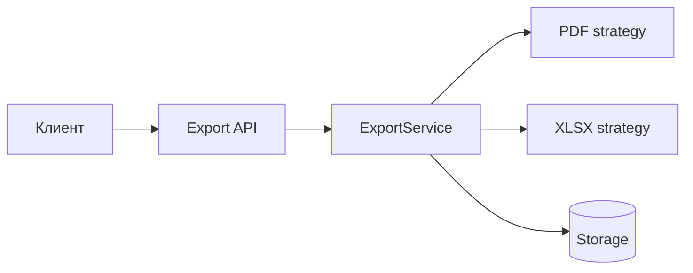

# Примеры моделей

Имена ниже условны. При работе заменяй их именами из плана и приложенных материалов, а не дополняй модель вымышленными компонентами.

## Древовидный стек

Подходит, когда важно показать вложенность, владение или последовательное прохождение уровней.

```text
Как есть сейчас
Запуск экспорта
└── ExportController
    └── LegacyExporter
        ├── формирует документ
        └── отправляет файл в Storage

Как будет после
Запуск экспорта
└── ExportController
    └── ExportService
        ├── выбирает ExportStrategy по типу документа
        │   ├── PdfExportStrategy
        │   └── XlsxExportStrategy
        └── передаёт результат в Storage
```

После дерева кратко укажи, что изменилось: например, выбор формата вынесен из единого экспортёра в стратегии, а контракт передачи файла в `Storage` сохранён.

## Диаграмма последовательности

Подходит, когда смысл изменения определяется порядком вызовов, сообщениями или обработкой ошибки.





Не скрывай изменение порядка, повтора, асинхронности или обработки ошибок в подписи: покажи его стрелками и поясни последствия.

## Компонентная архитектура

Подходит, когда требуется обозначить ответственность компонентов и связи между подсистемами, а не внутренний порядок вызовов.





Сопроводи схему таблицей только при необходимости: «компонент — ответственность — изменение». Не превращай диаграмму в полный каталог классов.
